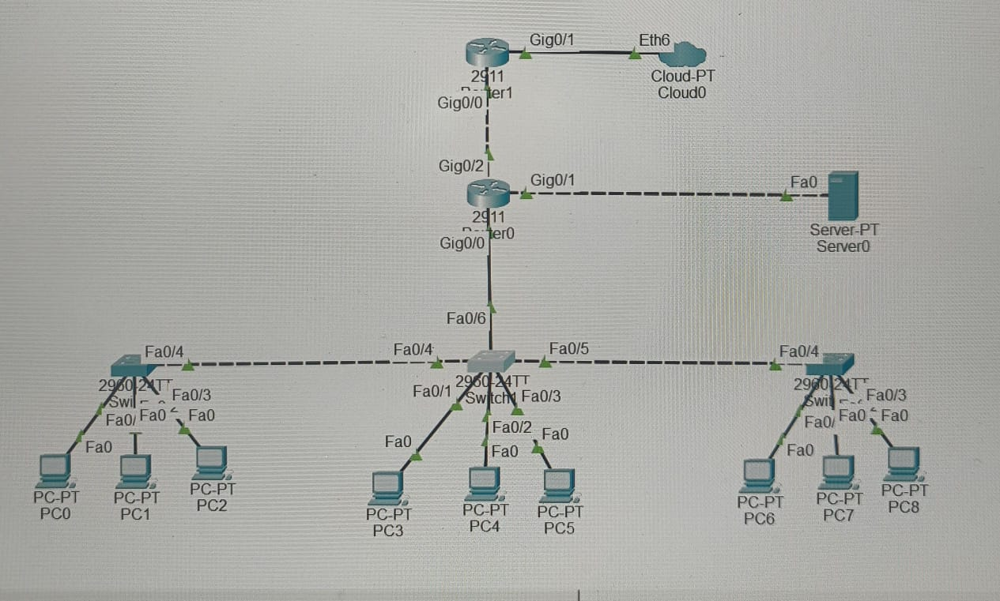

# enterprise-network-ccna-lab
Enterprise network simulation using VLAN,DHCP,NAT,ACL and static routing.
## Network Topology

## Technologies Used
- VLAN
- DHCP
- Static Routing
- NAT (PAT)
- Access Control List (ACL)
- Cisco Packet Tracer
